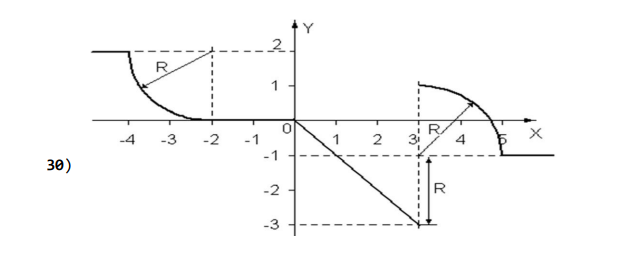
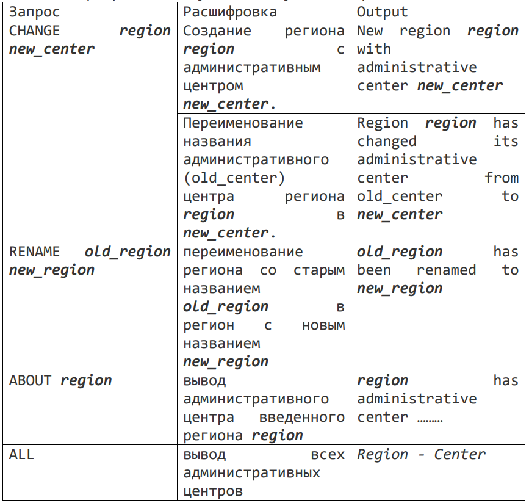

# Программирование семестр_2

## LR3
# Task_1
Вычислить и вывести на экран или в файл в виде таблицы
значения функции, заданной графически, на интервале от Xнач до Xкон с
шагом dx. Интервал и шаг задать таким образом, чтобы проверить все ветви
программы. Таблица должна иметь заголовком и шапку. 

# Task_2
Реализовать axmodp Сравнения по модулю простого числа
через теорему Ферма и свойства сравнений.

# Task_3
Реализовать обобщенный алгоритм Евклида для вычисления
с*d mod m=1.

# Task_4
Реализовать расширенный алгоритм Евклида для вычисления
взаимообратного числа с-1 mod m=d.

# Task_5
Написать программу, использующую алгоритм шифрования данных для преобразования исходного текста.
Передача ключей по алгоритму Хьюза.

# Task_6
Найти последнюю цифру «трехэтажного числа». Например, (3^7)^8

## LR4
# Task_1
Отделите корни заданного уравнения, и
уточните их одним из методов с точностью до ε=10-4 . Решить уравнения
методом половинного деления, методом Ньютона и методом простых итераций.
Либо другими методами, перечисленными в теоретической части к заданию 1.
𝑥^2 − 3 𝑠𝑖𝑛 𝑥 = 0

# Task_2
Необходимо описать распределение генератора, с помощью этого генератора
заполнить 3 массива размером 50, 100 и 1000 соответственно числами от 1
до 100.
Использовать критерий хи-квадрат для проверки гипотезы о нормальном
распределении выборки.

# Task_3
Выполнить программную реализацию метода «шаг младенца, шаг великана» и решить с помощью компьютера следующие уравнения:
2^x mod 30203 = 24322

## LR5
# Task_1
Необходимо реализовать систему хранения и обработки информации по заданию: График движения трамваев г. Новосибирска.

# Task_2
Необходимо реализовать справочник регионов России.
На вход программе поступают следующие запросы:

## LR6
# Task
Найти решение заданной системы (4 на 4) прямым и приближенным методами с точностью 
до ε=10-3. Решить систему уравнений методом Холесского.

## LR7
# Task
Написать 10 задач для решения которых будут применены алгоритмы из библиотеки algorithm. Также необходимо использовать лямбда функции.
